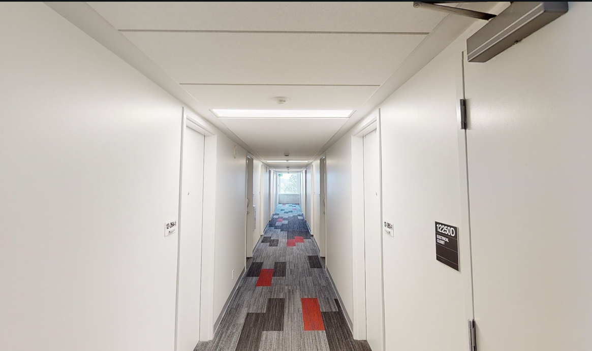

# A Review of First-Year Dorm Life

As my first year at UBC ends in a couple months, I thought I'd
make a little post reviewing how I've been living in my first year of university.

Also, I've started a commitment to make a new post at least twice a month.
I'm not using to blogging, but I want to try making a place to dump all my thoughts.

## Table of Contents

## The Complex
UBC has 3 main complexes for first years, Totem Park, Orchard Commons, and Place Vanier.
A quick summary of the 3 complexes:

- Place Vanier: The oldest complex, but a couple buildings are relatively new (built in the 2000s)
- Orchard Commons: The newest complex, only single or single connected rooms
- Totem Park: The most varied complex, with buildings dating to the 60s and others built in the last 10 years with all the bells and whistles.

What are the highlights of each building? 

- Vanier has a lot of older buildings, and has its infamous basement shared double dorms, but the sense of community is really strong,
and the common building is centrally located, so it's an overall pleasing complex. The buildings have also 
been updated a bit, so being put in the older Vanier buildings isn't the end of the world. 
- Orchard is overall the nicest building with a very modern design and spacious single or single connected rooms, but the sense of community is really lacking there. 
It doesn't help that the hallways in Orchard look very similar to a hospital.
- Totem, in my opinion, has the best mix. You have older buildings like Haida and Shuswap, with newer Orchard-style buildings like
`həm̓ləsəm̓` and `c̓əsnaʔəm`. Even the older buildings are nice to live in. The only downside is that some buildings are super far away from the commonsblock, which is inconvenient. 

<i>I'd probably go mad if this was my hallway for 8 months, it really looks like a hospital ward</i>

## The Building
I had asked for Vanier or Totem, since Orchard doesn't seem like a bright place to live in.
I got a building in Old Totem, which isn't the absolute best option, but I didn't see it as the worst option possible,
especially considering I could've gotten a basement suite at Vanier. Thankfully, Old Totem Park doesn't have any basement suites.

Each building is actually two houses connected by an interior hallway. Each building has a big study lounge with
a blackboard, whiteboard, and plenty of seats. Each floor also has its own floor lounge with a sink and TV,
but the one on my floor was occupied by another student (there's an [article](https://ubyssey.ca/news/ubc-assigning-first-year-students-temporary-living-spaces-amid-housing-crisis/) by the Ubyssey, UBC's newspaper, that details why).
The elephant in the room is the bathrooms. In Old Totem, each floor has 4 toilets and 3 showers, which are cleaned daily.
I've generally had good experiences with the bathrooms, but I have to be careful which shower I use because there's only
1 on my floor which actually has decent water pressure. Newer Totem building and Orchard have semi-private bathrooms, which are
nice but delegate the responsibility of cleaning the bathroom to you, so it's a decision you have to weigh when ranking
residence options at UBC>

## The Room
I have a shared double room, which means that both the beds, desks, and wardrobes are shared with another person.
There's also single rooms, which need no explanation, and single connected, where you have your own room but share a 
bathroom with another person.

My dorm actually is unique in the fact that it stretches wide rather than far due to fire code regulations (no one at UBC
could give me an actual answer, this is my speculation). While this does mean I do lose out on storage space compared to a normal
shared double, it does give me a lot more walkable area in the room, which is a nice perk to have.

_Excuse my messy room, but this is generally how it looks._
## Tips for Living in a Dorm
These tips helped me a lot into settling into my first space outside home.

- Communicate with your roommate about boundaries before moving in (quiet hours, alcohol usage, bringing people over)
- Clean up your room regularly so that you feel calm in your room (my picture didn't do a great job)
- Keep your room organized, everything should have a place so that you always know where to find stuff
- Decorate your room to keep it like home!
- Don't bring too many things int your dorm, you probably won't have space for them all
- Get out of your room from time to time and explore campus, there's a lot of study spaces and other nature to explore!

## Conclusion

Living in a dorm a few thousand kilometers away from home certainly was a challenging experience, but it's
really fun to live away from home for the first time. Since I got lucky and won the upper-year housing, I'll have the chance
to make another post in October about my next dorm, which will get to be even longer because there'll be a lot more to discuss.

Also, my next blog post is related to Discord. Maybe that'll motivate me to keep a consistent schedule.
