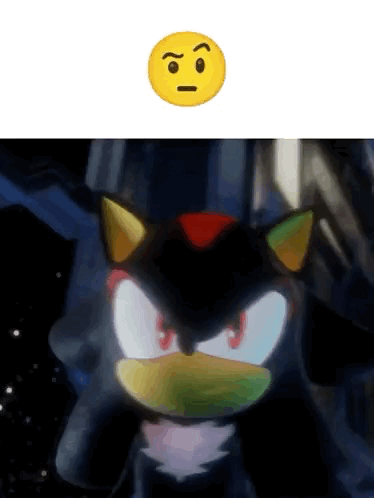

# Small Updates

Apologies for the slightly late post, but here are some updates I'd thought I share with you while I write a couple longer blog posts.

## Gradexis on the App Store

I haven't talked too much about this project, but Gradexis is an app that I've been working on with [ruskcoder](https://github.com/ruskcoder)
for many months. It's a grade viewing app inspired by apps like [GradeWay](https://gradeway.github.io/index.html) and GradePro. The main things
that set our app apart:

1. It's all free.  

Yeah, most of the paywalled featured are just hiding fancy calculators or require a bit of extra work, like push notifications. We're planning
on making all of those features free to show everyone the benefits of having a nicer platform to view your grades than the clunky interfaces HAC and Powerschool use. 
  
2. Speaking of Powerschool...

The apps I mentioned earlier don't support Powerschool SIS, which is a more modern grade platform. Our app has already added support for Powerschool
through the API, although it may take a bit longer to push since we want to make the experience bug-free.  

_Yes, this image looks like it was made by a soulless corporation, but please go give it a try._

## A Pay as you Go Oracle Account

For a very long time, I've been trying to make an Oracle account so that I would be able to experiment with a VPS. 
I even documented my journey into insanity in [one of my first posts](oracle_har_file). I'm glad to say I managed to make one, and
after a lot of emails with probably the most patient employee there, I managed to upgrade my account to Pay as you Go, which removes
the inaccessibility of the more powerful machines that Free users face.

Yep, you're probably wondering what black magic I managed to pull off (just kidding no one reads this), but I will explain
the chain of events that led to my situation, although I will have to warn anyone trying to follow my footsteps I will be leaving
out some key details to try not to get bad actors (aka spammers, scammers, and skids) to get an account. That may be my next post, or it
may be some other stuff I've been planning, like a post about iOS jailbreaking.

## Some Thoughts

It's been a long first year at UBC, so I'm quite glad I made it to the other side with a really good shot at my preferred major.
That's as much sappy stuff as I can write for a month, so I'll save you my ramblings and leave you with some aerial shots of UBC.

