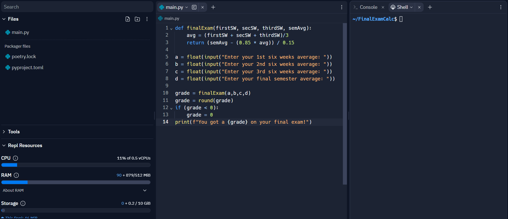

I've seen this happen so many times, and I'm sick of it. I'm going to explain why you shouldn't use "free" hosting services, and why you should just pay for a VPS.
Sometimes you can even get a VPS for FREE, so there's no need to worry about money. So why put youself up with the troubles of "free" hosting services?

## Table of Contents

## The Allure of "Free" Hosting

A lot of young developers, or people who don't have a lot of money, are attracted to the idea of "free" hosting. It's understandable, you don't have to pay anything, and you get a server to host your bot on. But, there's a lot of downsides to this, and I'm going to explain them.

## The Downsides

### Underpowered Machines

Most of these "free" hosting services are running on a Raspberry Pi, or some other underpowered machine.
Even if they have good servers, you almost always have to pay for them, which defeats the purpose.

This means that your bot will be running on a machine that can barely handle it, and will be slow. This is especially bad if you're using a library like discord.py, which is already not the fastest.
The problem could be mitigated with discord.js, but that's avoiding the problem, and it's still not going to be as fast as a VPS.
So if you somehow want to have more than 3 commands that aren't ping commands, you're going to have a bad time.

_This is JUST 13 lines of code for just multiplication, and it's already using almost 20% of the RAM. Imagine a Discord bot._

### Unreliable

Repeat after me: **Free hosting is unreliable.**
Most of these services are run on tiny shared servers, and they're not going to be able to keep it up 24/7. This means that your bot will be down for a lot of the time, and you won't be able to do anything about it.
If you're hoping to get that shiny checkmark for your bot on Discord, you're going to be crushed when you get rejected because your bot's
not even online.

### No 24/7 Runtime

Replit stops the program after 1 hour of inactivity, and you have to manually start it again. This means that your bot will be offline for a lot of the time, and you won't be able to do anything about it.
While you can ping the server to keep it online, this consumes even MORE resources, and will make your bot even slower.
While I do admit that VPSs can also have this problem, it's much easier to fix and doesn't impact performance at a noticeable level.

### Ephemeral Storage

Replit has ephemeral storage, which means that all files created during runtime will be deleted after the session closes.
This means that you can't save any data, and you can't use a database. This is a huge problem, and it's why you should never use Replit for a Discord bot.
If you want to save user data, Replit is NOT the way to go.

### BIG ONE: Shared IPs

This is the biggest problem with "free" hosting services, and it's why you should never use them.
Most of these services use shared IPs, which means that you're sharing an IP with other people. This means that if someone else on the same IP as you does something bad, like spam or raids, your IP will be banned. This means that you won't be able to use Discord anymore, and you'll have to get a new IP.
Even if you make a new bot, you'll still be vulnerable to this, so you don't want to deal with this

## Conclusion

Just, save yourself the headache, and get a VPS. You can get a VPS for free, and it's much better than using "free" hosting services.
I personally use Oracle's Free tier, and it's more than enough for a Discord bot. I host a Minecraft server AND a Discord bot on it, and it's still not using all the resources.
You can also use Google Cloud, AWS, or any other VPS provider. However, do your own research, and make sure that you're getting a good deal and that it meets all your needs.

Just, for the love of god, don't use Replit, Heroku, or ANY other "free" hosting provider. Otherwise, we'll have a problem.
😡
