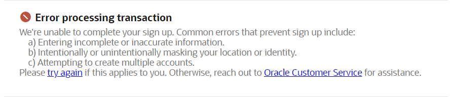
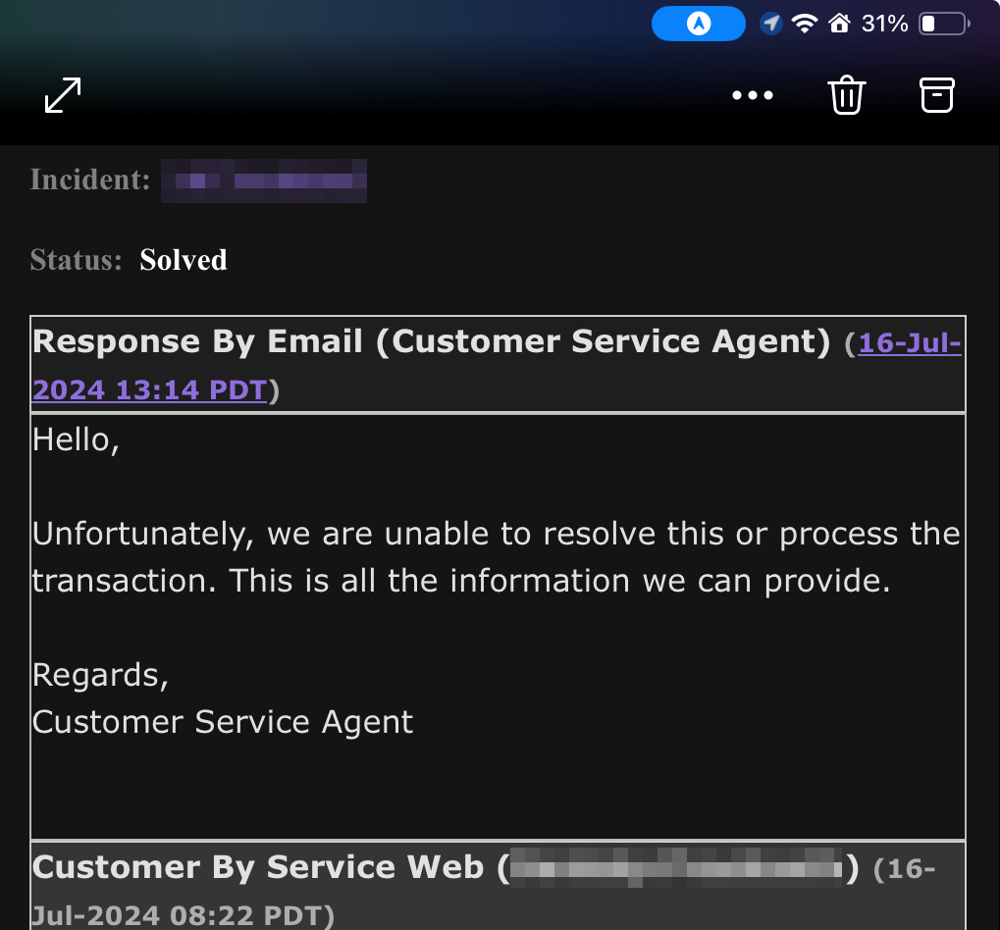
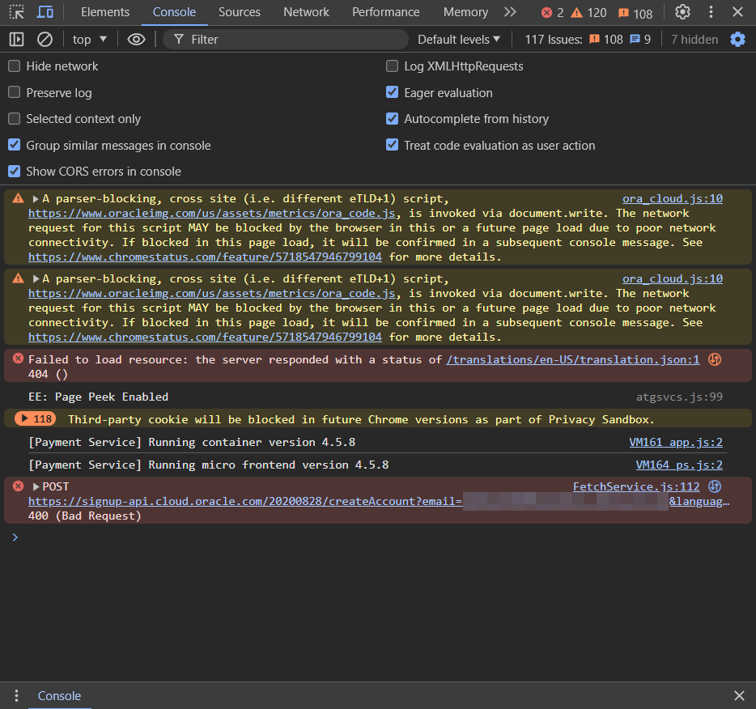
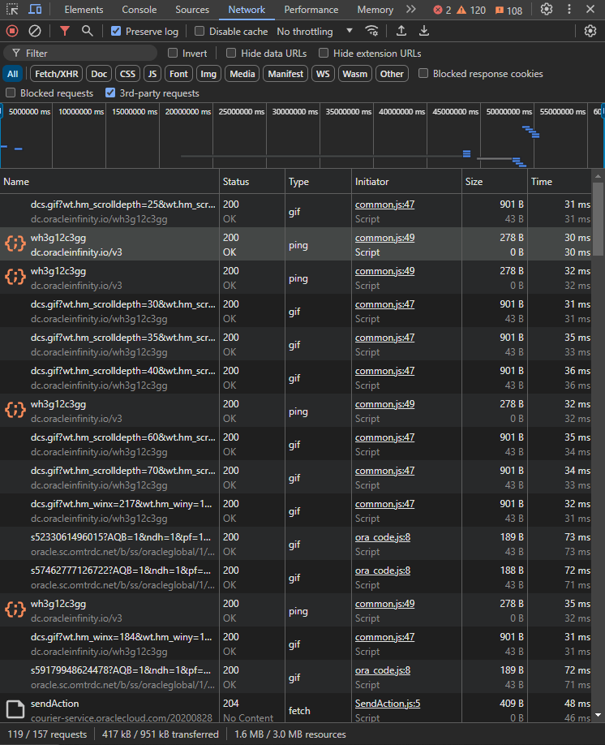
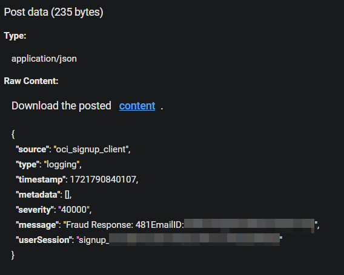
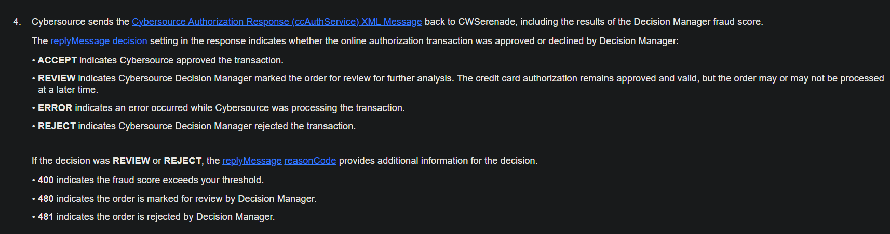

In a previous post, I recommended Oracle Cloud due to its extremely generous free tier.
However, I didn't mention that Oracle Cloud has a very convoluted anti-fraud system that can be triggered by the smallest things.
If you're not blessed by the three monkeys powering their signup system, you'll have to go through a very long process to get your account verified.
In this article, I'm going to talk about how a single HAR file led me down a rabbit hole of credit cards, anti-fraud systems, and Oracle Cloud's seething
indifference towards suspicious activity.

## Table of Contents

# The Situation

A previous Oracle account using different data from a family member was suspended due to "suspicious activity." As far as I can recall,
it had something to do with me deleting and attempting to make a new instance due to me being stupid and misconfiguring the server, but
I doubt I'll ever get a true answer. Contacting support somehow managed to be less helpful than a brick wall, so I decided to make a new account with my own data.


_I'd say that Oracle Cloud Support is as unresponsive as a brick wall, but that'd be an insult to brick walls everywhere._

However, attempting to create my own account brought this dreaded error, familiar to anyone who's ever tried to make a
new Oracle Cloud account:


_Technically, it's not a "transaction," but I digress._

For almost any (sane) person, they'd pack it up and choose another hosting provider. AWS and GCP offer pretty good free tiers, and they don't have
such a convoluted signup process. If you need cheap, reliable hosting, there's a plethora of options available. However, being the insane person I am,
I took this as a challenge to dig to the bottom and get myself an account.

The [Oracle Cloud subreddit](https://reddit.com/r/oraclecloud) was my first stop.
Searching just "unable" yields many results from people who have faced the same issue.
While a lucky few managed to get their accounts verified by Oracle Support, most were left in the dark, with no way to get their accounts verified.

Doomscrolling through Reddit wouldn't get me anywhere, so I decided to take a more technical approach.
However, before I did so, I spent a few weeks ~~pestering~~ politely asking Oracle Support to remove any anti-fraud
flags on my account. I was met with the same copy-paste response every time. As [u/Ok_Entertainment328](https://www.reddit.com/user/Ok_Entertainment328)
put it,

```
there's something off with your informative that makes it look similar to those
commonly known to exploit our system anf we're not going to tell the world (which includes you)
what we don't like so that the undesirable cant find a loophole. Instead, here is a generic
unhelpful error message.
```


_If you go back in time on Reddit, the agents used to sign their names. Doesn't take much to figure out why
they changed it to "Customer Service Agent"_

However, a couple days ago, I had the idea of signing up again, not out of copium, but as a way to gleam what made Oracle feel
like Gandalf with the "You shall not pass!" attitude.

I go through the normal signup process, but keep my console open for the 2nd part of the registration, in hopes of seeing what's going
on in the backend. For the most part, everything seemed normal, up until I clicked "Start my Free Trial."
Firstly, I got that dreaded error message, but that's last month's news, so I wasn't interested in that. However, the console revealed a clue that blew this mystery open.


_This 400 code ironically was a godsend_

However, the real shebang came when I opened the `Network` tab and found this beauty (or monstrosity, take your pick).


There was a lot of stuff going on, but what caught my eye was that small download button in the top right corner.
What would it download, you may ask?

Well, the answer is...

# The HAR File

Download a HAR file, get a HAR file, what else did you expect?

## Well, WTF Is a HAR File?

Ok, I'll admit I have some explaining to do.

Whenever you open a webpage, your computer sends many requests to the server hosting the website. These requests can be for images, scripts, or even the webpage itself.
The server then sends back a response, which your computer uses to render the webpage. A HAR file is a log of all these requests and responses, which can be seen
in the `Network` tab of your browser's developer tools.

HAR files are an archival format for webpages, the last mention of them was in 2012 (12 years ago) through a W3C developer specification which was abandoned.
Their spiritual successor, WARC files, are used by the Internet Archive to cache webpages.

## Ok, So How Do I Get One?

Pretty simple, actually. Open your browser's developer tools, go to the `Network` tab, and click the download button.
It'll save a `.har` file to your computer, but you'll need special tools to read it, as a text reader won't give you the most readable format.
Google offers a [free tool](https://toolbox.googleapps.com/apps/har_analyzer/) to read HAR files, but there are many other tools available.
Before we continue, I should stress that you should NEVER share your HAR file with anyone, as it contains cookies, passwords, and other sensitive data
that no one else should have access to.

## So, Why Are You Talking About It?

Well, you can always access this data through the `Network` tab, but having a HAR file allows you to analyze it in conjunction with cookies
and other site data, allowing more investigative work. In my case, I was able to see what Oracle was doing in the background, and why they were blocking me.
With that out of the way, let's cover what I discovered.

# The Analysis

I opened the HAR file in Google's HAR Analyzer, and was greeted with a wall of text. However, doing some digging brought up some
details that allowed me to piece together what Oracle was doing.

## Fraud Response

This is the part of the HAR file that explains why I got rejected, although it's the starting point. This response is hidden by a generic 400 error I showed
in a previous image, but it's the most important part of the HAR file. It contains the reason why Oracle rejected my account, and it's the key to understanding
why I've never been able to get an account.


_Remember the number 481, it's going to be important later._

The 481 is a common reoccurrence in the POST data that's logged in the HAR file, so I knew that something related to that code
was a clue. Another network request showed a similar response, but most of it was garbled before I unescaped the URL.
I can't show the image because it contains sensitive data, but one string was what led to the next part of my investigation.

```angular2html
cloud:en-us:oracle-cloud-free-tier-signup/]oci-signup:en:s2-received-fraud-status:reject-status-by-cybersource
```

# Cybersource

## What's Cybersource?

[Cybersource](https://www.cybersource.com/en-us/solutions/fraud-and-risk-management/decision-manager.html) is a fraud detection service created by Visa, and it's used by many companies to detect fraud in online transaction.
It's a very powerful tool, but understandably very vague to prevent exploitation. However, it's also very sensitive, and can be triggered by the smallest things.
The specific tool used is Decision Manager, which is a rules-based fraud detection system that uses machine learning to detect fraud.

## How Does This Relate to Oracle?

Oracle uses Cybersource to detect fraud in their signup process. If you trigger Cybersource, you're going to have a very hard time
creating an account.

## So, What About The 481 Code?

Ah yes, that code. Well, if you dig into [Oracle's documentation](https://docs.oracle.com/cd/E62114_01/oroms/pdf/5/cws_help/SO04_16CYB.htm#Rcw93707), you'll find that the 481 code is a "reject" code, meaning that Cybersource
has rejected your payment information. This is the reason why I've never been able to create an account.


_The 481 code is a reject code, meaning that Cybersource has rejected your payment information._

## Wait, There's More?

Yes, there is. The HAR file also contained other information that helped me reach a conclusion.
In another network request, I found a line detailed as

```angular2html
 "paymentGatewayAuthAVSCode": "X"
```

After some digging into [Cybersource's documentation](https://developer.cybersource.com/docs/cybs/en-us/avs-codes/reference/all/na/avs-codes/avs-codes-intro/avs-codes-other-processors.html),
I found that the `X` code means `Match: street address and nine-digit postal code match.`
This means that my address and postal code matched, but something else didn't. My hunch: an external fraud detection system.
This would mean that while Cybersource is finding a match, it's rejecting my account due to suspicions of fraud from my information.

# Conclusion

I've been blocked from creating an Oracle Cloud account due to Cybersource's fraud detection system.
While I can't say for sure what triggered it, I can say that it's been a very frustrating experience.
I confronted Oracle Cloud Support with this information, but the agent didn't have a clue as to what I was waffling
about, although they promised to escalate my closed case past the first level of support, which is better than nothing.
I'm not sure if I'll ever get an account, but I'm not going to give up. I'll keep trying until I get an account, even if it takes me months.

I hope this article has been informative, and I hope that you've learned something from it. If you have any questions, feel free to ask me on [Discord](https://discord.com/users/942859618130989087).
